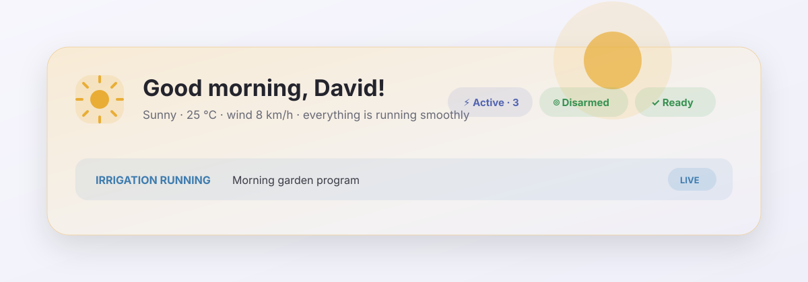

# Luma

A polished, context-aware Lovelace card suite for Home Assistant.



Luma replaces deeply nested `button-card` and `card-mod` configurations with
small, reusable web components. It shares one responsive visual language across
heroes, room summaries, controls, live status, tabs, and Material-inspired
bottom sheets while keeping actions and entity selection configurable at runtime.

## Cards

| Card | Purpose |
| --- | --- |
| `custom:luma-home-hero-card` | Weather-aware home hero, dynamic greeting, incidents, acknowledgements, alarm, waste and irrigation context |
| `custom:luma-hero-card` | General-purpose responsive hero with chips, badge and banners |
| `custom:luma-heading-card` | Compact section heading with optional navigation/action affordance |
| `custom:luma-control-card` | Entity action with mapped state and contextual styling |
| `custom:luma-control-group-card` | Dense, responsive row of controls |
| `custom:luma-metric-card` | Primary and secondary live metrics |
| `custom:luma-room-card` | Room summary with environment and quick actions |
| `custom:luma-action-card` | Compact scene, service, or navigation action |
| `custom:luma-comfort-card` | Indoor comfort and air-quality summary |
| `custom:luma-climate-card` | Compact climate controller |
| `custom:luma-tab-card` | Responsive tab container for any Lovelace cards |
| `custom:luma-active-card` | Runtime-filtered list of active entities |
| `custom:luma-popup-card` | Hash-driven, draggable Material-style bottom sheet |
| `custom:luma-alarm-card` | Alarm status with segmented, confirmed arming and disarming controls |
| `custom:luma-status-card` | Small entity or attribute status card |
| `custom:luma-sensor-grid-card` | Responsive, grouped sensor values without `entities` or `card-mod` |
| `custom:luma-remote-card` | Android TV remote with a large D-pad, integrated playback rail and app shortcuts |
| `custom:luma-gate-card` | Gate and garage controls with inline confirmation or an anchored action popover |
| `custom:luma-cover-card` | Cover position, motion state, progress bar and open/stop/close controls |
| `custom:luma-disclosure-card` | Compact expandable container for related controls |
| `custom:luma-temperature-card` | Comfort-colored temperature hero and comparable room scale |
| `custom:luma-energy-flow-card` | Animated live solar, home and grid power flow |
| `custom:luma-history-card` | Recorder-backed canvas history chart with signed ranges, gradients and touch inspection |
| `custom:luma-navigation-card` | Contextual navigation card with shared Luma styling |
| `custom:luma-homelab-hero-card` | Dynamic Kuma, Komodo and infrastructure health summary |
| `custom:luma-rack-cooling-card` | Rack thermal delta, fan speed and PWM visualization |
| `custom:luma-irrigation-hero-card` | Context-aware irrigation system status hero |
| `custom:luma-irrigation-schedule-card` | Schedule controller with equal-width weekday buttons |
| `custom:luma-irrigation-zone-card` | Adjustable timed zone start/stop with confirmation and live progress |
| `custom:luma-irrigation-program-card` | Confirmed program launch with live progress |
| `custom:luma-logbook-card` | Recorder-backed event history grouped by day |
| `custom:luma-update-card` | Confirmed update installation with live progress |
| `custom:luma-timeline-card` | Responsive camera-event timeline with authenticated snapshots and video playback |
| `custom:luma-camera-activity-card` | Latest security event with playable authenticated thumbnail and on-demand live camera selector |
| `custom:luma-waste-hero-card` | Dynamic next-collection summary with urgency and acknowledgement state |
| `custom:luma-waste-collection-card` | Next collection date and countdown for a waste schedule sensor |
| `custom:luma-waste-ack-card` | Confirmed, state-aware bin placement acknowledgement |
| `custom:luma-lawn-hero-card` | Contextual robot mower status, battery and progress hero |
| `custom:luma-lawn-control-card` | Confirmed start, resume and stop controls with live task progress |
| `custom:luma-battery-hero-card` | Dynamic low-battery summary with critical and warning counts |
| `custom:luma-battery-grid-card` | Runtime-discovered, sorted battery devices without template-generated cards |
| `custom:luma-layout-card` | Child-card grid with independent desktop, tablet and mobile column counts |
| `custom:luma-appliance-card` | Appliance state, remaining time and cycle progress |
| `custom:luma-entity-grid-card` | Fast runtime-filtered responsive entity collection without `auto-entities` templates |
| `custom:luma-weather-forecast-card` | Responsive daily forecast with an hourly, data-rich per-day detail sheet |

`luma-control-card` automatically recognizes active lights and media players,
and actions with `confirmation` use an inline second-tap confirmation state.
Lights receive a warm accent and brightness subtitle; media players receive a
distinct media accent and show the current title or application when available.
For a relay whose Home Assistant domain does not describe its physical use,
set `display_as: light`. This changes only presentation and active-state
styling; actions still target the entity's real domain.
Light controls open Home Assistant's More Info dialog on long press by default,
giving direct access to brightness, color temperature, and color controls when
the entity supports them. An explicit `hold_action` overrides this behavior.

The home hero's alarm chip opens an anchored alarm control by default. Its
`alarm_modes` remain runtime-configurable, each state change requires an
explicit second confirmation tap, and `alarm_action` continues to open the
full detailed alarm sheet. Set `alarm_popover: false` to keep the direct action.

`luma-cover-card` supports `master`, `group`, and `compact` variants, allowing
the same behavior and visual language to cover whole-house, room, and individual
shutter controls. Destructive group actions can use inline second-tap confirmation.

`luma-gate-card` defaults to permanently visible controls with second-tap
confirmation. Set `display: popover` for compact overview cards: the first tap
opens a control surface anchored to that card, and the labelled confirmation
action performs the state-aware open or close command. Moving covers offer stop
instead, and an optional pedestrian button can share the same surface.

```yaml
type: custom:luma-gate-card
entity: cover.driveway_gate
name: Driveway
kind: cover
display: popover
pedestrian_entity: button.driveway_pedestrian_open
```

Security-oriented layouts can use `compact_mobile: true` on
`luma-alarm-card`, `surface: true` on `luma-sensor-grid-card`, and a numeric
`top_spacing` on `luma-hero-card`. These options keep kiosk headers clear of
the viewport edge and make dense alarm and zone controls more comfortable on
small screens without changing their desktop behavior.

`luma-irrigation-zone-card` can use a shared firmware duration number and
dedicated start/stop button entities while remaining compatible with direct
switch toggle configurations. Each card keeps its own ad-hoc duration in
browser storage. Its compact minus/plus controls change only that local value;
after the second confirmation tap, the card writes the value to the shared
number and then presses the zone start button sequentially. Minimum, maximum,
and step values still come from the number entity.

```yaml
type: custom:luma-irrigation-zone-card
entity: switch.garden_zone
name: Garden
duration_entity: number.custom_zone_duration
default_duration: 10
start_entity: button.start_garden_custom_duration
stop_entity: button.stop_irrigation
progress_entity: sensor.active_zone_progress
remaining_entity: sensor.active_zone_remaining
```

The home hero accepts `irrigation_zone_entities` in addition to
`irrigation_entity`, so manually or ad-hoc started zones also produce the
irrigation banner. Entries may be entity IDs or objects with a shorter display
name.

```yaml
irrigation_entity: sensor.active_irrigation_program
irrigation_zone_entities:
  - entity: switch.garden_zone
    name: Garden
  - switch.drip_zone
```

`luma-timeline-card` is intentionally data-source agnostic. It reads an `events`
attribute from a sensor and expects each item to provide `timestamp`, `type`,
`snapshot`, and `url`; this keeps integrations responsible for fetching events
while Luma owns presentation. The attribute name, visible item count, column
count, and excluded event types remain configurable at runtime. Snapshot tiles
show a tone-aware shimmer while authenticated images load and a clear fallback
when an image is missing or unavailable. Set `initial_items` to keep long
timelines compact behind an explicit expand/collapse control.

Event video uses Home Assistant's chunked UniFi Protect proxy directly. The
player requests data eagerly, starts as soon as the first playable MP4 data is
available, and uses muted inline autoplay for mobile-browser compatibility;
sound can be enabled from the native controls.

```yaml
type: custom:luma-timeline-card
entity: sensor.front_door_timeline
title: Front door events
max_items: 24
columns: 2
exclude_types:
  - lowMemory
```

## Installation

Add this repository to HACS as a custom **Dashboard** repository and install
Luma. HACS registers `/hacsfiles/lovelace-luma/lovelace-luma.js` as a module;
refresh the browser after an update.

For local development:

```bash
npm install
npm run check
npm run build
```

The HACS-compatible bundle is written to `dist/lovelace-luma.js`.

## Active entity filtering

The home hero and active card use the same runtime filter language. Rules are
evaluated against the current Home Assistant state and entity registry, so no
rebuild is needed when the dashboard configuration changes.

```yaml
active:
  # Both default to true. Hidden or disabled registry entries are ignored.
  exclude_hidden: true
  exclude_disabled: true
  include:
    # Keep useful light groups as one item.
    - entity: light.sofa_lights
      state: "on"
      tap_action:
        action: toggle

    # Then add individual lights, without duplicating groups.
    - domain: light
      state: "on"
      exclude_groups: true

    - domain: media_player
      state_not: ["off", "idle", "standby", "unknown", "unavailable"]

    - domain: climate
      attribute: hvac_action
      state: ["heating", "cooling", "drying", "fan"]

    - entity_pattern: sensor.*_power
      above: 10
  exclude:
    - light.all_lights
    - light.*_bulb_*

  # Integrations such as Zigbee may expose overlapping groups without a
  # member list. Keep one semantic representation when several are active.
  collapse:
    - entities:
        - light.terrace_lights
        - light.outdoor_wall_lights
        - light.terrace_relay
      prefer: light.terrace_lights
```

An include rule accepts `entity`, `entity_pattern`, or `domain`, plus `state`,
`state_not`, `above`, `below`, `attribute`, `exclude_groups`, and an optional
`tap_action`. Use `display_as: light` for a relay that should use light styling
and behavior, and `area_name` to provide the secondary location label when an
integration entity or group has no area in Home Assistant's registry.
`exclude` accepts entity-id globs. Earlier matching rules win the
display order and duplicate entity IDs are collapsed. Each `collapse` entry
also accepts entity-id globs; if multiple listed entities are active, `prefer`
is retained (or the first displayed match when the preferred entity is absent).
This is useful for integration-level groups that do not expose
`attributes.entity_id`, where automatic member-based deduplication is not
possible in the browser.

Use the same block under `custom:luma-active-card`:

```yaml
type: custom:luma-active-card
name: Active now
active:
  exclude_hidden: true
  # Broad domain rules ignore switch-as-light wrappers by default. Override
  # this list, or include a specific entity explicitly, when one is intentional.
  exclude_platforms:
    - switch_as_x
  include:
    - domain: light
      state: "on"
      exclude_groups: true
```

## Popup example

## Room example

```yaml
type: custom:luma-room-card
name: Living room
icon: mdi:sofa-outline
path: /dashboard-rooms/living-area
temperature_entity: sensor.living_room_temperature
humidity_entity: sensor.living_room_humidity
items:
  - entity: light.living_room
    name: Light
    icon: mdi:lightbulb-outline
    tap_action:
      action: toggle
  - entity: media_player.living_room
    name: TV
    icon: mdi:television
    tap_action:
      action: more-info
  - entity: cover.living_room
    name: Shade
    icon: mdi:window-shutter
    tap_action:
      action: more-info
```

The environment entities and quick items are optional. Items use the shared
Luma condition, state mapping, color, and action fields, so the card also fits
utility rooms, outdoor areas, and media-focused spaces.

## Popup example

```yaml
type: custom:luma-popup-card
hash: "#active"
title: Active devices
icon: mdi:lightning-bolt-outline
max_width: 720
cards:
  - type: custom:luma-active-card
```

The popup has a scrim, a draggable dismiss handle, and an edit-mode preview so
it remains selectable in the Lovelace editor.

## Home hero example

```yaml
type: custom:luma-home-hero-card
weather_entity: weather.home
alarm_entity: alarm_control_panel.home
tap_action:
  action: navigate
  navigation_path: /lovelace/weather
active_action:
  action: navigate
  navigation_path: "#active"
alarm_action:
  action: navigate
  navigation_path: "#alarm"
waste_items:
  - entity: sensor.general_waste
    name: General
  - entity: sensor.plastic_waste
    name: Plastic
incidents:
  - entity_pattern: sensor.*_monitored_url
    state_not: Up
    message: "{count} monitored services unavailable"
    tone: error
    aggregate: true
    navigation_path: /dashboard-homelab/overview
```

Incident rules accept an exact `entity`, an `entity_pattern` glob, or
`device_classes`, together with `state`, `state_not`, `above`, `below`, and
`for_minutes`. `{name}` expands per entity and `{count}` works with
`aggregate: true`. Configuring an input-text acknowledgement entity enables
per-incident 7- or 30-day dismissal; error incidents remain visible.

## Actions

Cards support `none`, `navigate`, `more-info`, `toggle`, `perform-action`, and
the legacy `call-service` action spelling.

## License

[MIT](LICENSE)
